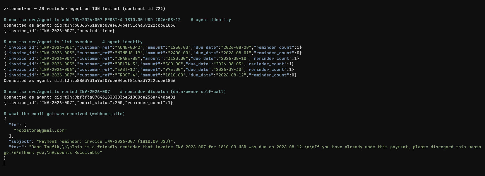

# z-tenant-ar

An accounts-receivable reminder agent on [Terminal 3's T3N](https://docs.terminal3.io), built for the T3N Agent Build Challenge. It chases overdue invoices by email without ever holding the customer's name or address: the TEE contract stores business data only, and the customer's PII is substituted into the outgoing email by the host, from the data owner's profile, at dispatch time.

## Why this shape

Dunning is a real workflow that normally forces the worst trade: the automation that sends the reminder has to know who the customer is. Here it doesn't.

- Invoice records hold `invoice_id`, `customer_ref`, amount, currency, due date. Input structs `deny_unknown_fields`, so a payload that tries to smuggle an email address into the KV map fails at parse time.
- `send-reminder` builds the email with `{{profile.first_name}}` and `{{profile.verified_contacts.email.value}}` markers and POSTs it through the host's `http-with-placeholders` interface. The host resolves the markers from the calling user's profile after the contract returns the payload, so plaintext PII never enters WASM memory.
- Egress is authorized by the data owner's `agent-auth-update` grant (contract, functions, allowed hosts), not by the contract itself.
- A 20-hour cooldown per invoice lives in the contract, so a double-fired cron cannot spam anyone.

## Layout

```
contract/   Rust TEE contract (wasm32-wasip2 component)
  src/lib.rs        exports: upsert-invoice, list-invoices, send-reminder
  src/invoices.rs   KV-map records, overdue logic (cluster timestamp, not wall clock)
  src/remind.rs     placeholder email via http-with-placeholders, cooldown
src/        TypeScript (Node) side, @terminal3/t3n-sdk
  setup.ts    one-time tenant setup: register WASM, create maps, seed secrets
  grant.ts    data-owner grant: functions + egress host for an agent DID
  agent.ts    agent CLI: add | list | remind | run (cron entry point)
```

## Run it

```sh
# toolchain: rust + wasm32-wasip2 target, node >= 22
cd contract && cargo test && cargo build --target wasm32-wasip2 --release && cd ..
npm install
cp .env.example .env       # fill in keys; see comments there
npx tsx src/setup.ts 0.1.0 # register contract, create maps, seed secrets
npx tsx src/grant.ts --self
npx tsx src/agent.ts add INV-2026-001 ACME-0042 1250.00 USD 2026-08-20
npx tsx src/agent.ts list overdue
npx tsx src/agent.ts remind INV-2026-001
npx tsx src/agent.ts run   # remind every overdue invoice, cooldown-safe
```

Verified against T3N testnet 2026-08-26: contract id 724, reminder delivered with both placeholders resolved host-side, cooldown refusal on the second attempt. Re-verified 2026-09-12 on `@terminal3/t3n-sdk` 5.2.0 (now pinned exact, the version Terminal 3 asked entrants to use): list, reminder delivery (HTTP 200, placeholders resolved) and the cooldown skip in `run` all unchanged.



## Identity note

Metered calls are charged to the calling identity's own T3N balance. The agent runs under its own funded DID (`did:t3n:b886...`) for `add`, `list` and `run`. The `send-reminder` egress step currently only succeeds as a data-owner self-call: on today's testnet, egress grants resolve from the caller's own grant record only, and there is no documented way for an agent to bind the granting user's context for `{{profile.*}}` resolution. Details, repro table and request ids in [docs/BUGS.md](docs/BUGS.md); question open with Terminal 3 devrel. `agent.ts` picks up whichever key `AGENT_KEY` holds, so the moment delegated calls work, the same CLI covers the full flow.

## Maintenance

Built to keep running after the challenge with near-zero attention:

- `setup.ts` is idempotent; re-deploying a new contract version is `cargo build` + `setup.ts <higher-version>`.
- `agent.ts run` is the whole operational surface: one cron line (`npx tsx src/agent.ts run`), safe on any schedule because the 20h cooldown lives in the contract, not the scheduler.
- No database and no server; all state is in the tenant's KV maps on T3N. The repo's only secrets are in the untracked `.env`.
- Swapping the demo webhook for a real gateway (e.g. Resend) is a `.env` change (`EMAIL_ENDPOINT`, `EMAIL_API_KEY`), no code.
