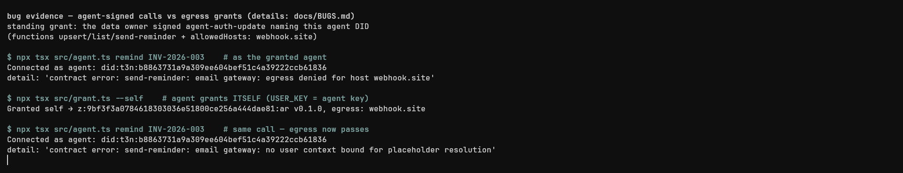

# Bugs and doc gaps hit while building (T3N testnet, 2026-08-26)

Environment: `@terminal3/t3n-sdk` latest from npm, Node 26.7, `setEnvironment("testnet")`. Tenant `did:t3n:9bf3f3a0784618303036e51800ce256a444dae81`, agent `did:t3n:b8863731a9a309ee604bef51c4a39222ccb61836`, contract `z:9bf3f3a0...:ar` (id 724). Request ids included so you can pull server logs.

## 1. Agent-signed calls never see the data owner's egress grant

**Expected (per docs):** the walkthrough's flight example has the data owner sign `agent-auth-update` naming the agent's DID (functions + `allowedHosts`), after which the agent's plain `executeAndDecode` works, and "Outbound HTTP is authorized by the user, not the contract" says egress is resolved from the calling user's grant, with "Delegated call → the subject user's grant".

**Actual:** egress is only ever resolved from the **caller's own** grant record. Tested by elimination, one variable at a time, on `send-reminder` (a function doing `http-with-placeholders` to a granted host):

| grant signer (data owner) | caller | result |
|---|---|---|
| user U | tenant | `egress denied` |
| tenant (self-grant) | tenant | works |
| tenant | agent | `egress denied` (req `89e01786-6625-462d-b5ae-4d6aee90659e`) |
| user U | agent | `egress denied` (req `89287d17-f4b9-41c9-94d2-39961cd4c916`) |
| tenant, as the **only** grant naming the agent | agent | `egress denied` (req `1da92a5e-04de-4a5a-8cc7-f0a984344bce`) |
| agent (self-grant) | agent | egress passes, then bug 2 (req `08a8e379-d443-49ea-b1b7-491f743c3bd4`) |

The last row shows the egress check itself flips on a self-grant, so the grant content and host list are fine; the lookup just never considers grants signed by other identities.

 Either delegated calls need something a plain `execute` doesn't carry (see bug 2), or the deployed grant resolution doesn't match the docs.

## 2. No documented way for an agent to bind the granting user's context

With the agent self-granted (so egress passes), the same call fails with:

```
contract error: send-reminder: email gateway: no user context bound for placeholder resolution
```

which is fair — the host can't know whose `{{profile.*}}` to resolve. But the public `execute`/`executeAndDecode` payload has no field to name a subject user, and the docs' own "SDK surface observed in the wild" section lists `buildDelegationCredential()` / `signAgentInvocation()` as unverified and says to ask on Telegram rather than guess. Net effect: the headline flow (agent acts on a user's data, host resolves PII via placeholders) is not reachable from the documented SDK surface. The demo works end to end only as a data-owner self-call.

## 3. Claim page is documented as the way to get a funded agent key, but re-claiming returns the same identity

Docs ("Registering your agent"): "a key generated outside the claim page starts with no credits, so the claim page is the practical path." For a developer who already claimed a tenant key, signing in again with the same email returns the byte-identical key and DID — there is no way to mint a second, funded identity for the agent role self-serve. A locally generated agent key then fails its first metered call:

```
InsufficientCreditError: InsufficientCredit (account=b886..., required=10000000000, available=0)
```

and funding required an admin transfer (thanks Ian — turnaround was fast). Suggest either letting one account mint N funded sub-identities or documenting the admin-funding step where agent keys are introduced.

## 4. `agent-auth-update` silently replaces the signer's whole agent list

The `agents: [...]` array is last-write-wins per data owner: granting agent B removes an earlier grant for agent A with no warning and no read-back API surfaced in the walkthrough. Easy to lose a working grant while iterating. Worth documenting, or making the op a merge/patch.

## 5. DX: every `RpcError` stack dumps the whole minified SDK bundle line

The SDK ships as one ~1MB obfuscated line; Node prints the failing source line in stack traces, so every error prints ~64KB of `_0x12269d(...)` noise before the useful `detail:` field. A source map or multi-line build would fix it. Related nit: contract errors arrive with `httpStatus: -32602` (a JSON-RPC error code in an HTTP field), while credit errors use a real `httpStatus: 403`.
